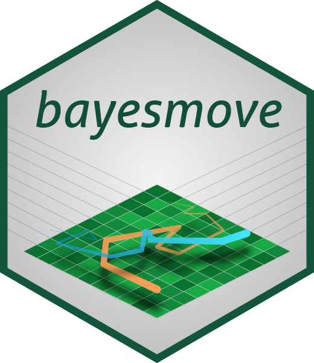

<!-- README.md is generated from README.Rmd. Please edit that file -->

```{r, include = FALSE}
knitr::opts_chunk$set(
  collapse = TRUE,
  comment = "#>",
  fig.path = "man/figures/README-",
  out.width = "100%"
)
```

# bayesmove <a href="reference/figures/logo.png"></a>

<!-- badges: start -->
[](https://travis-ci.com/joshcullen/bayesmove)
[](https://ci.appveyor.com/project/joshcullen/bayesmove)
[](https://codecov.io/gh/joshcullen/bayesmove?branch=master)
<!-- badges: end -->

## Introduction

The goal of **bayesmove** is to analyze animal movement using a non-parametric Bayesian framework,
which addresses a number of limitations of existing segmentation methods and state-space models. This framework allows the analysis of multiple telemetry and biologging data streams, which must be discretized into a set of bins before they can be analyzed. This package also includes features to check model convergence. Model output are often returned in a format that is `tidyverse`-friendly, which allows for easy visualization using `ggplot2`.

## Installation

You can install **bayesmove** from [GitHub](https://github.com/) with:

``` r
# install.packages("remotes")
remotes::install_github("joshcullen/bayesmove")
```

This package is currently being prepared for submission to CRAN.

## Support

If you are receiving errors from the model output that you believe to be bugs, please report them as issues in the GitHub repo. Additionally, if there are any other features you would like added  to this package, please submit them to the issue tracker. 
