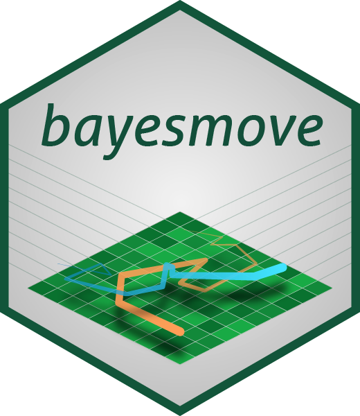

<!-- README.md is generated from README.Rmd. Please edit that file -->

# bayesmove 

<!-- badges: start -->

[](https://CRAN.R-project.org/package=bayesmove)
[](https://github.com/joshcullen/bayesmove/actions)
[](https://codecov.io/gh/joshcullen/bayesmove?branch=master)
[](https://CRAN.R-project.org/package=bayesmove)
[](https://CRAN.R-project.org/package=bayesmove)
<!-- badges: end -->

## Introduction

The goal of **bayesmove** is to analyze animal movement using a
non-parametric Bayesian framework, which addresses a number of
limitations of existing segmentation methods and state-space models.
This package currently offers two different model frameworks on which to
make behavioral inference from animal telemetry data: 1) **segment-level
behavioral state estimation** and 2) **observation-level behavioral
state estimation**.

The model that makes segment-level inference is a two-stage framework
that first partitions individual tracks into segments and subsequently
clusters these segments into latent behavioral states. This framework
allows the analysis of multiple telemetry and biologging data streams,
which must first be discretized into a set of bins before they can be
analyzed. The model that makes behavioral inference at the
observation-level also requires that data streams are first discretized,
but then directly clusters these observations together into behavioral
states within a single step. While the outcome is similar to that from
state-space and hidden Markov models, this observation-level model does
not assume an underlying Markov property or use a mechanistic process
(e.g., correlated random walk).

This package also includes features to check model convergence based on
the log-likelihood for each MCMC iteration. Model output are often
returned in a format that is `tidyverse`-friendly, which allows for easy
visualization using `ggplot2`.

## Installation

You can install the latest CRAN release with:

``` r
install.packages("bayesmove")
```

You can install the latest **stable** version of the package from GitHub
with:

``` r
# install.packages("remotes")
remotes::install_github("joshcullen/bayesmove")
```

or latest development (**unstable**) version with:

``` r
# install.packages("remotes")
remotes::install_github("joshcullen/bayesmove@dev")
```

If installing from GitHub, ensure that you have a tool installed for
compiling C++ code:

-   For PC’s running Windows, install
    [Rtools](https://cran.r-project.org/bin/windows/Rtools/) if you have
    not already done so.

-   For Mac’s, install the [Command Line Tools for
    Xcode](https://developer.apple.com/download/more/) by executing
    `xcode-select --install` in the terminal; or you can download the
    latest version from the URL (free developer registration may be
    required). A full Xcode install uses up a lot of disk space and is
    not required.

## Support

If you are receiving errors from the model output that you believe to be
bugs, please report them as issues in the GitHub repo. Additionally, if
there are any other features you would like added to this package,
please submit them to the issue tracker.
