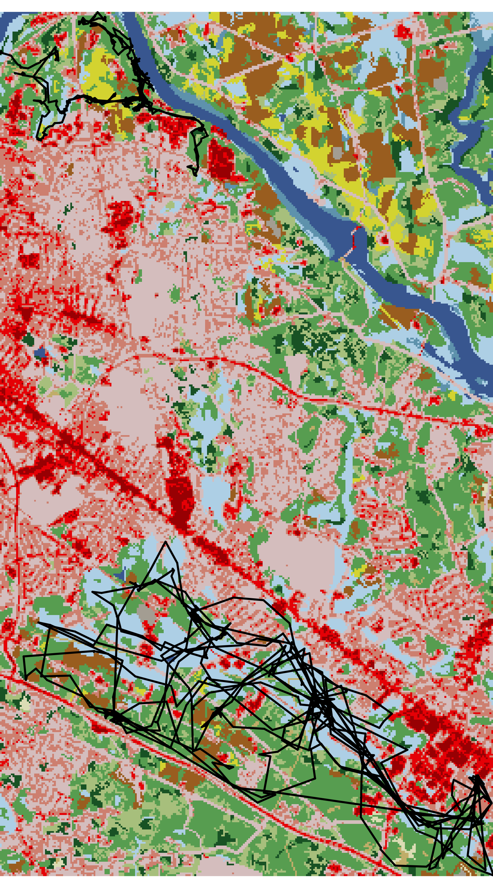

```{r, include = FALSE}
knitr::opts_chunk$set(
  collapse = TRUE,
  comment = "#>",
  fig.width=7,
  fig.retina=2
)
```


## Introduction

The creation of maps is essential to understanding animal movement patterns over space and time, but these maps nearly always show spatial patterns at the expense of time. The "flattening" of temporal patterns of animal movement over geographic space can preclude a detailed understanding of how animals move across a landscape (or seascape). This is particularly true when individuals exhibit high site fidelity or there are many overlapping tracks from multiple individuals.

During the data exploration stage, it is particularly useful to become familiar with relationships between movement patterns and covariates of interest. However, this process can be difficult when practitioners only rely on static maps that obscure the temporal pattern exhibited by an organism.

As an example, below is a static plot of the `fisher` dataset (LaPoint et al., 2013) included within the `move` package. The land use basemap was downloaded from the supporting material from Muff et al. (2019).


```{r load, message=FALSE, eval=FALSE}
library(bayesmove)
library(move)
library(dplyr)
library(ggplot2)
library(lubridate)

# Load data
data(fishers)

# View static tracks
lines(fishers, col = "black", lwd = 2)
```

```{r load data, message=FALSE, echo=FALSE}
library(bayesmove)
library(move)
library(dplyr)
library(ggplot2)
library(lubridate)

# Load data
data(fishers)
```
<p align="center">

</p>

Even with an underlying basemap, it is apparent that these movement patterns are difficult to discern other than these fishers move within a confined home range and typically avoid developed areas (red). It is also unclear how long these individuals were tracked and whether they exhibited regular movement across the home range each day or at different periods of the study.

While we could potentially subset these data to create a grid of plots at some time interval of interest (e.g., days, months, seasons, years), this can take unnecessarily long to try different combinations for one or multiple tagged individuals. Additionally, it would be difficult to explore patterns in the intrinsic properties of movement itself (e.g., identify episodic periods of high site fidelity, looping forays, or what locations animals move to during periods of thermal stress). Therefore, we have created a R Shiny application within the `bayesmove` package to dynamically explore animal movement patterns.


## Dynamic exploration of animal movement patterns

Users can quickly render their data in the Shiny app using the `shiny_tracks()` function, which only requires a data frame and an EPSG code to map the tracks. At a minimum, this data frame must have columns labeled 'id', 'x', 'y', and 'date' where 'date' is of class `POSIXct`. Any other variables can also be included within the data frame, but only time series of numeric values can be visualized and filtered as of now.

In this example, coordinates recorded in WGS84 UTM 18N are used since they are measured in meters, which allows for intuitive understanding for calculated step lengths and net-squared displacement. Upon first running the function, users should be brought to a page that allows dynamic exploration of individual movement patterns:

```{r first step, eval=FALSE}
# Convert from `Move` object to data frame
fishers2<- data.frame(fishers) %>% 
  mutate(id = trackId(fishers)) %>% 
  rename(date = study.local.timestamp)

# Calculate step lengths, turning angles, and net squared displacement
fishers2<- prep_data(dat = fishers2, coord.names = c("utm.easting","utm.northing"),
                     id = "id")

# Run Shiny app
shiny_tracks(data = fishers2, epsg = 32618)

```

```{r second step, echo=FALSE}
# Convert from `Move` object to data frame
fishers2<- data.frame(fishers) %>% 
  mutate(id = trackId(fishers)) %>% 
  rename(date = study.local.timestamp)

# Calculate step lengths, turning angles, and net squared displacement
fishers2<- prep_data(dat = fishers2, coord.names = c("utm.easting","utm.northing"),
                     id = "id")
```


<br>
<br>
This screenshot shows the general layout of the Shiny app, which has two tabs: the first is for exploration of individual movement patterns and the second is for the exploration of all individuals simultaneously.

We can see on the sidebar that there is a dropdown menu to change which animal ID to explore and another dropdown menu to visualize the time series of a given variable in the data frame, which is shown as the plot at the top. Since the first column in the data frame (apart from 'id') is shown initially, you will see the numeric form of a time variable. The map shown below is the entire track for 'Leroy', where the green dot is the starting location and the red dot is the ending location.

To dynamically explore a more interesting variable, such as net-squared displacement, we can change the variable in the dropdown menu and then click and drag on the time series plot to only highlight a particular time period of interest on the map.
<br>
<br>


<br><br><br>

<br><br><br>


<br>
<br>
Each of these screenshots shows a different period selected over this time series. The first and third maps show a foray behavior where Leroy takes approximately 1 day to move across his home range and return to his starting location. The second screenshot shows very little movement during the morning until noon, after which leroy starts to move again. Other variables and IDs could also be explored. It may even be useful to zoom in on the satellite basemap to see exactly what type of land cover is being traversed or occupied.

***

In addition to dynamic exploration of individuals, it may also be useful to explore how multiple individuals move over time, especially if interactions among individuals are suspected. We can visualize these patterns in the 'View all tracks' tab.
<br>
<br>


<br>
<br>
In this module of the Shiny app, users can select/deselect multiple IDs to visualize. For this `fishers` dataset, there are only 2 individuals. Additionally the slider at the top can be dragged to change the size and position of the time window of interest. This action will dynamically update the map to only include IDs that were tracked during the time period of interest.
<br>
<br>


<br><br><br>

<br>
<br>
If any other features are desired (e.g., loading raster layers, filtering of selected variables, exporting a filtered set of observations, etc), feel free to send requests by e-mail (joshcullen10 [at] gmail [dot] com) or submit as an issue on the GitHub page for `bayesmove`.


## References

LaPoint S, Gallery P, Wikelski M, Kays R. (2013). Animal behavior, cost-based corridor models, and real corridors. *Landscape Ecology*, 28(8), 1615–1630. [doi:10.1007/s10980-013-9910-0](http://dx.doi.org/10.1007/s10980-013-9910-0).

LaPoint S, Gallery P, Wikelski M, Kays R. (2013). Data from: Animal behavior, cost-based corridor models, and real corridors. *Movebank Data Repository*. [doi:10.5441/001/1.2tp2j43g](http://dx.doi.org/10.5441/001/1.2tp2j43g).

Muff, Stefanie; Signer, Johannes; Fieberg, John R. (2019). R Code and Output Supporting "Accounting for individual-specific variation in habitat-selection studies: Efficient estimation of mixed-effects models using Bayesian or frequentist computation". Retrieved from the Data Repository for the University of Minnesota, https://doi.org/10.13020/8bhv-dz98.
