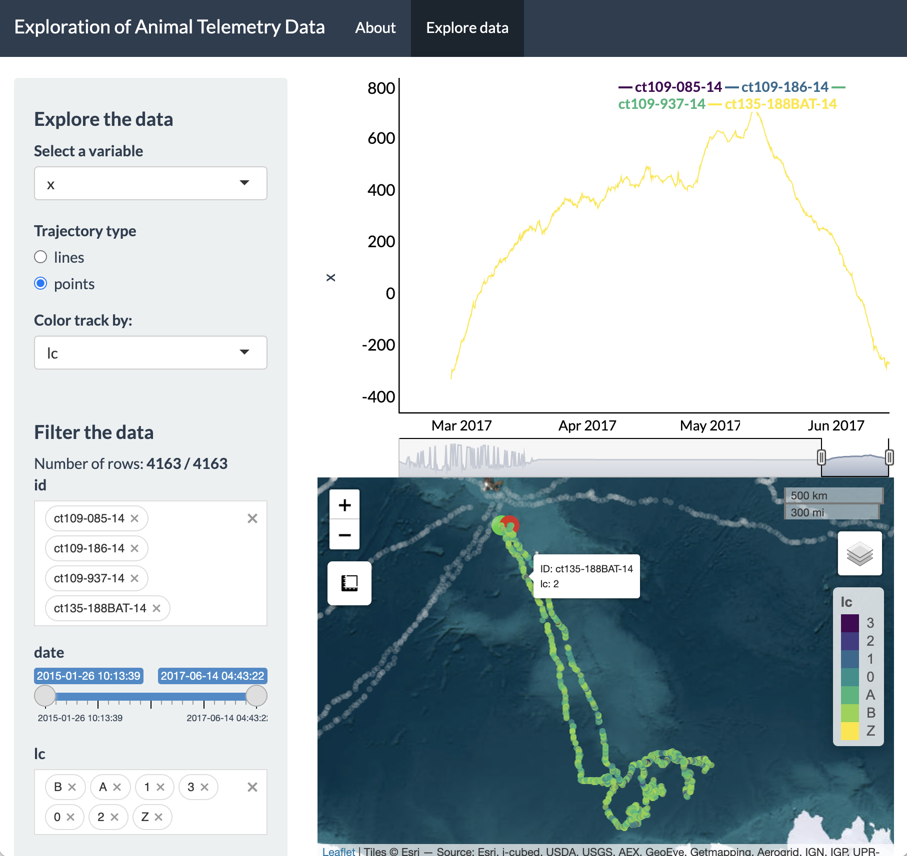

```{r, include = FALSE}
knitr::opts_chunk$set(
  collapse = TRUE,
  comment = "#>",
  fig.width=7,
  fig.retina=2,
  fig.align = 'center'
)
```


## Introduction

The creation of maps is essential to understanding animal movement patterns over space and time, but these maps nearly always show spatial patterns at the expense of time. The "flattening" of temporal patterns of animal movement over geographic space can preclude a detailed understanding of how animals move across a landscape (or seascape). This is particularly true when individuals exhibit high site fidelity or there are many overlapping tracks from multiple individuals.

During the data exploration stage, it is particularly useful to become familiar with relationships between movement patterns and covariates of interest. However, this process can be difficult when practitioners only rely on static maps that obscure the temporal pattern exhibited by an organism.

As an example, below is a static plot of the `sese` (southern elephant seal) dataset (Jonsen et al., 2019) included within the `aniMotum` package (previously called `foieGras`) (Jonsen et al., 2023).


```{r load, message=FALSE, warning=FALSE, eval=TRUE, class.source = 'fold-show'}
library(bayesmove)
library(aniMotum)
library(sf)
library(rnaturalearth)
library(dplyr)
library(ggplot2)
library(lubridate)
library(datamods)

# Load data
data(sese)

# Change column names to match required names for shiny_tracks()
# Change projection to calculate step lengths, turning angles, and net-squared displacement metrics
sese.sf<- sese %>% 
  rename(x = lon, y = lat) %>% 
  st_as_sf(., coords = c("x","y"), crs = 4326) %>% 
  st_transform(crs = "+proj=laea +lat_0=-90 +lon_0=75 +ellps=WGS84 +units=km +no_defs") %>% 
  dplyr::mutate(x = unlist(purrr::map(.data$geometry, 1)),
                      y = unlist(purrr::map(.data$geometry, 2)))

# Convert back to data.frame w/ projected coordinates
sese2<- sese.sf %>% 
        sf::st_drop_geometry()

# Convert sf object to MULTILINESTRING
sese.sf<- sese.sf %>% 
  group_by(id) %>%
  summarize(do_union = FALSE) %>%
  st_cast("MULTILINESTRING")

# Define bounding box of seal tracks
bbox<- st_bbox(sese.sf)


# Calculate step lengths, turning angles, and net squared displacement
sese3<- prep_data(dat = sese2, coord.names = c("x","y"), id = "id")
  

# Load land spatial data
world<- ne_countries(scale = 110, returnclass = "sf") %>% 
  st_transform("+proj=laea +lat_0=-90 +lon_0=75 +ellps=WGS84 +units=km +no_defs")


# View static tracks
ggplot() +
  geom_sf(data = world, fill = "grey45") +
  geom_sf(data = sese.sf, aes(color = id), size = 1) +
  scale_color_brewer(palette = "Dark2", guide = "none") +
  theme_minimal() +
  coord_sf(xlim = bbox[c(1,3)], ylim = bbox[c(2,4)])
```


It is apparent that these southern elephant seals are central-place foragers and are undertaking a looping migration. However, it is unclear how long these individuals were tracked, if they all performed migratory movements at the exact same time, and how long they spent at foraging locations before continuing to travel in a fast and directed behavior.

While we could potentially subset these data to create a grid of plots at some time interval of interest (e.g., days, months, seasons, years), this can take unnecessarily long to try different combinations for one or multiple tagged individuals. Additionally, it would be difficult to explore patterns in the intrinsic properties of movement itself (e.g., identify episodic periods of high site fidelity, looping movements, or relationships in spatiotemporal patterns between individual animals). Therefore, we have created a R Shiny application within the `bayesmove` package to dynamically explore animal movement patterns.


## Dynamic exploration of animal movement patterns

Users can quickly render their data in the Shiny app using the `shiny_tracks()` function, which only requires a data frame and an EPSG code (or PROJ string) to map the tracks. At a minimum, this data frame must have columns labeled 'id', 'x', 'y', and 'date' where 'date' is of class `POSIXct`. Any other variables can also be included within the data frame, but only time series of numeric values can be currently be visualized and explored.

In this example, the Lambert Azimuthal Equal Area, WGS84 projection ("+proj=laea +lat_0=-90 +lon_0=75 +ellps=WGS84 +units=km +no_defs") is used since the coordinate units are in kilometers, which provides an intuitive set of units for step lengths and net-squared displacement. Upon first running the function, users are brought to a page that lists instructions and information for using the app (in the 'About' tab). Clicking on the 'Explore data' tab allows dynamic exploration of movement patterns from multiple individuals:

```{r first step, eval=FALSE, class.source = 'fold-show'}
# Run Shiny app
shiny_tracks(data = sese3, epsg = "+proj=laea +lat_0=-90 +lon_0=75 +ellps=WGS84 +units=km +no_defs")

```

```{r second step, echo=FALSE}
## Need to add code to import screenshot
# knitr::include_graphics('Shiny-Fig1.png')
# knitr::include_graphics('Shiny-Fig2.png')
```
<p align="center">

</p>
<br>
<br>

This screenshot shows the general layout of the Shiny app, which let's users select a variable to dynamically explore, filter variables from their dataset, and visualize a time series plot as well as an interactive map of these data. Additionally, users can toggle between visualizing their set of locations as lines or points and change the color of the points according to a selected variable of interest. To provide a concrete example, let's explore the southern elephant seal data further.

We can see on the sidebar that there are two main headers that break up this panel: 1) Explore the data, and 2) Filter the data. Under the 'Explore the data' header, you can select any variables from your data frame (besides `id` or `date`) to visualize an interactive time series. Additionally, a radio button is provided to toggle between mapping your spatial coordinates as a trajectory (line) or as a set of points on the interactive Leaflet map. When viewed as points (only), users can choose a variable from the "Color track by:" dropdown menu.

Let's say we were interested in exploring the East-West movement patterns of all 4 individuals: we would click on the "Select a variable" dropdown menu at the top and change this to `x`.
<br>
<br>
```{r third step, echo=FALSE}
## Need to add code to import screenshot
# 

```
<p align="center">

</p>
<br>
<br>
From this time series plot, we can see that three IDs were transmitting simultaneously during 2015, whereas the remaining ID transmitted afterwards in 2017. Additionally, it is also very obvious that these seals are moving in a variety of directions from the island of Kerguelen. The line plot and the tracks on the Leaflet map are both colored by ID, where green circles denote starting locations and red circles denote ending locations.

We can also switch to viewing the tracks as points and have these points colored by a variable other than ID, such as Argos location class quality ('lc').

<p align="center">

</p>
<br>
<br>

To dynamically explore a more interesting variable, such as net-squared displacement (NSD), we can change the variable in the dropdown menu and then click and drag on the time series plot to only highlight a particular time period of interest on the map (e.g., 2015).
<br>
<br>
```{r fourth step, echo=FALSE}
## Need to add code to import screenshot
# knitr::include_graphics('Shiny-Fig4.png')

```
<p align="center">

</p>
<br>
<br>
We now see a zoomed in version of the time series plot of NSD and only the three IDs tagged in 2015 showing up on the Leaflet map. This example demonstrates that updating the time window of the time series plot will impact the map. Additionally, setting constraints on variables from the "Filter the data" section of the sidebar will also impact what data will be shown in the time series plot and map.
<br>
<br>
```{r fifth step, echo=FALSE}
## Need to add code to import screenshot
# knitr::include_graphics('Shiny-Fig5.png')

```
<p align="center">

</p>
<br>
<br>
When inspecting the plot of NSD over time, we can see a pattern where NSD is essentially zero at the beginning (February) and end (September) of the time series, but in between it is gradually increasing to its maximum value during the austral fall/winter before gradually decreasing to zero by the austral spring. This is useful to know, but we can inspect even finer temporal resolution patterns of these movements, particularly at their greatest extent (i.e., April to June). To do so, all we have to do is click and drag on the plot for this time window and the Leaflet map will update the extent of the zoomed-in tracks, as well as showing the full tracks in grey while the "highlighted" time window is shown in color.
<br>
<br>
```{r sixth step, echo=FALSE}
## Need to add code to import screenshot
# knitr::include_graphics('Shiny-Fig6.png')

```
<p align="center">

</p>
<br>
<br>
With this new time window selected, we can pan around and zoom-in to each ID. The green and red circles denote the first and last location for the selected time window, which has now been updated.
<br>
<br>
```{r seventh step, echo=FALSE}
## Need to add code to import screenshot
# knitr::include_graphics('Shiny-Fig7.png')

```
<p align="center">

</p>
<br>
<br>
Additionally, the basemap can be adjusted and the tracks can be toggled on and off (including whether you prefer to view only the highlighted portion of the track, the full track length, or both).
<br>
<br>

An online version of this app can be found [here](https://joshcullen.shinyapps.io/segmentation_of_NSD). If any other features are desired (e.g., loading raster layers, choosing among multiple color palettes, etc), feel free to send requests by e-mail (joshcullen10 [at] gmail [dot] com) or submit as an issue on the GitHub page for `bayesmove`.


## References

Jonsen ID, McMahon CR, Patterson TA, Auger-Methe M, Harcourt R, Hindell MA, Bestley S. (2019). Movement responses to environment: fast inference of variation among southern elephant seals with a mixed effects model. *Ecology*, 100:e02566. [doi:10.1002/ecy.2566](https://doi.org/10.1002/ecy.2566).

Jonsen I, Grecian WJ, Phillips L, Carroll G, McMahon CR, Harcourt RG, Hindell MA, Patterson TA. (2023). aniMotum, an R package for animal movement data: Rapid quality control, behavioural estimation and simulation. *Methods in Ecology and Evolution*, [doi:10.1111/2041-210X.14060](https://doi.org/10.1111/2041-210X.14060).

